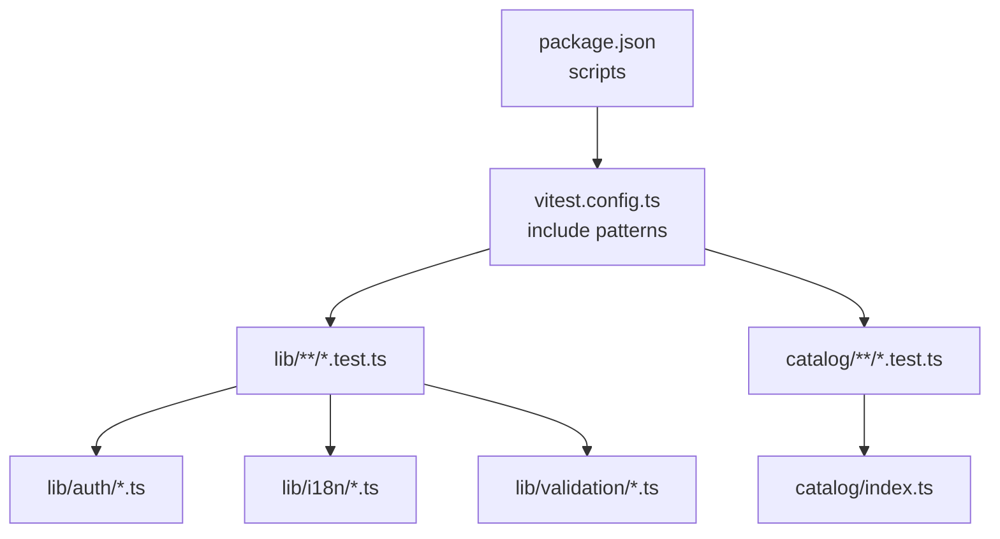
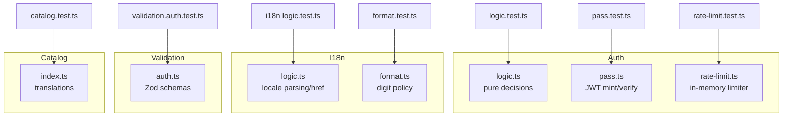
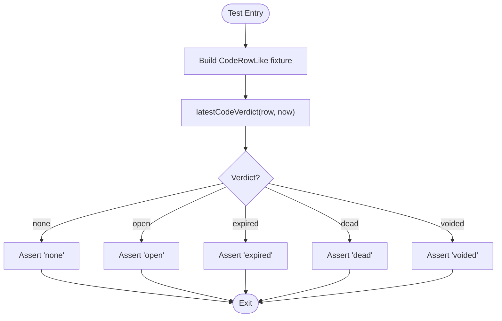
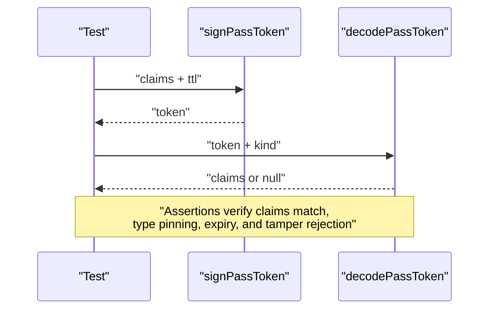
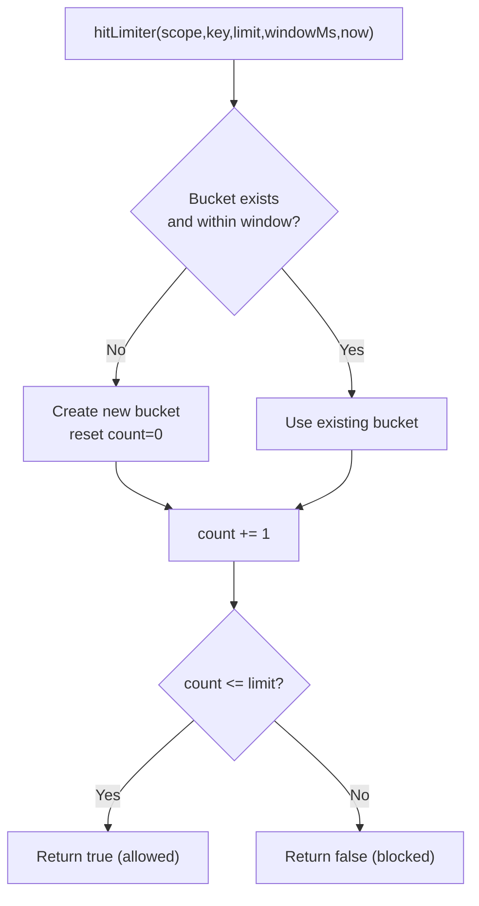
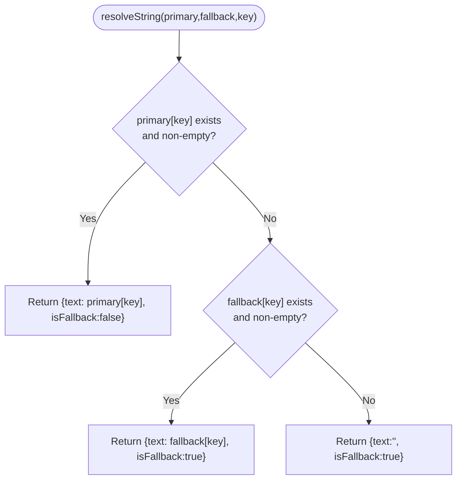
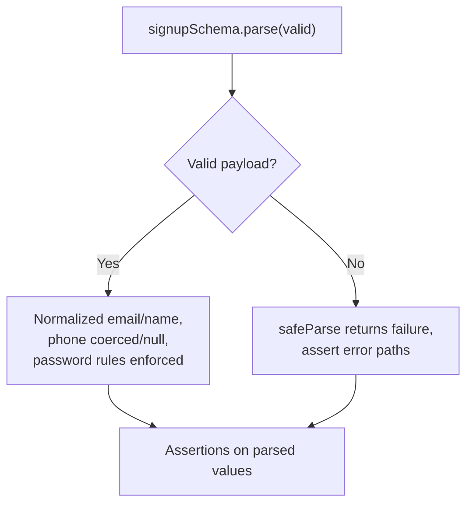
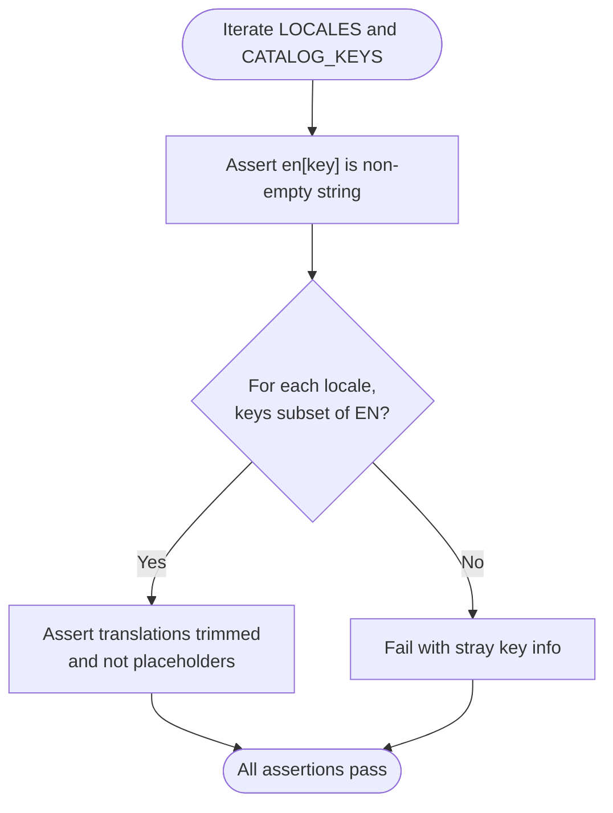
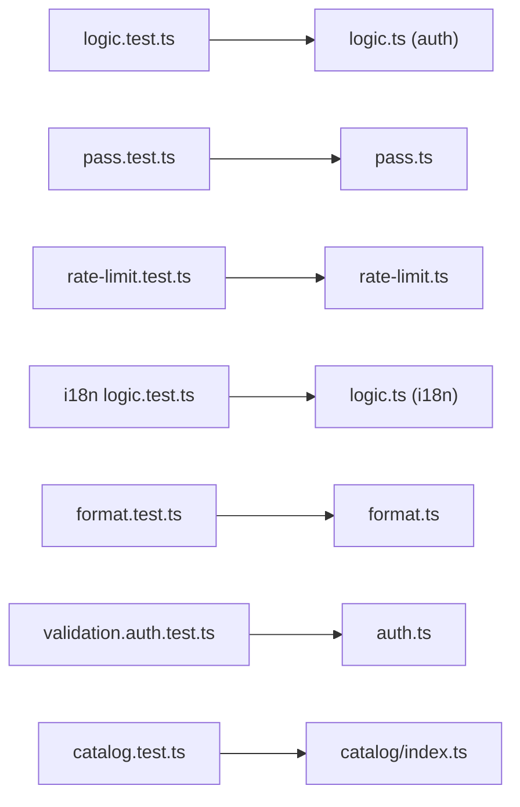

# Unit Testing

<cite>
**Referenced Files in This Document**
- [vitest.config.ts](file://vitest.config.ts)
- [package.json](file://package.json)
- [catalog.test.ts](file://catalog/catalog.test.ts)
- [logic.test.ts](file://lib/auth/logic.test.ts)
- [pass.test.ts](file://lib/auth/pass.test.ts)
- [rate-limit.test.ts](file://lib/auth/rate-limit.test.ts)
- [format.test.ts](file://lib/i18n/format.test.ts)
- [logic.test.ts (i18n)](file://lib/i18n/logic.test.ts)
- [auth.test.ts](file://lib/validation/auth.test.ts)
- [logic.ts (auth)](file://lib/auth/logic.ts)
- [pass.ts](file://lib/auth/pass.ts)
- [rate-limit.ts](file://lib/auth/rate-limit.ts)
- [format.ts](file://lib/i18n/format.ts)
- [logic.ts (i18n)](file://lib/i18n/logic.ts)
- [auth.ts](file://lib/validation/auth.ts)
</cite>

## Table of Contents
1. Introduction
2. Project Structure
3. Core Components
4. Architecture Overview
5. Detailed Component Analysis
6. Dependency Analysis
7. Performance Considerations
8. Troubleshooting Guide
9. Conclusion
10. Appendices

## Introduction
This document provides comprehensive unit testing guidance for Agropioo’s utility functions and business logic. It covers Vitest configuration, test organization patterns, mocking strategies for external dependencies, and detailed approaches to testing authentication logic, internationalization utilities, validation schemas, and catalog management. It also includes examples for asynchronous operations, error handling, edge cases, and best practices for maintainable tests with proper assertions, test data management, and coverage reporting.

## Project Structure
Agropioo uses Vitest as the test runner with a Node environment. Tests are colocated next to their source modules under lib/ and catalog/, following a consistent naming convention: <module>.test.ts. The project scripts expose a single command to run all tests.

**Diagram sources**
- [package.json:5-11](file://package.json#L5-L11)
- [vitest.config.ts:4-13](file://vitest.config.ts#L4-L13)

**Section sources**
- [package.json:5-11](file://package.json#L5-L11)
- [vitest.config.ts:4-13](file://vitest.config.ts#L4-L13)

## Core Components
The repository contains focused unit tests across four areas:
- Authentication logic: pure decision functions, code lifecycle, session validity, and pass token round-trips.
- Internationalization: locale parsing, href generation, message formatting, and number digit policy.
- Validation schemas: Zod-based input normalization and constraint enforcement for auth flows.
- Catalog integrity: ensuring translation completeness and correctness across locales.

Key characteristics:
- Pure functions are tested deterministically by injecting time via parameters.
- Asynchronous JWT operations are tested against real cryptography helpers.
- In-memory state is isolated per test using explicit reset hooks.
- Catalog tests enforce structural invariants across locales.

**Section sources**
- [logic.test.ts:1-127](file://lib/auth/logic.test.ts#L1-L127)
- [pass.test.ts:1-93](file://lib/auth/pass.test.ts#L1-L93)
- [rate-limit.test.ts:1-46](file://lib/auth/rate-limit.test.ts#L1-L46)
- [format.test.ts:1-25](file://lib/i18n/format.test.ts#L1-L25)
- [logic.test.ts (i18n):1-133](file://lib/i18n/logic.test.ts#L1-L133)
- [auth.test.ts:1-97](file://lib/validation/auth.test.ts#L1-L97)
- [catalog.test.ts:1-36](file://catalog/catalog.test.ts#L1-L36)

## Architecture Overview
The unit tests validate both pure logic and stateful integrations:
- Pure logic (auth decisions, i18n routing, validation) is deterministic and fully covered by fast unit tests.
- Pass tokens use real JWT signing/verification; tests assert cryptographic behavior without network calls.
- Rate limiting uses an in-process Map with deterministic time injection and test-only reset.
- Catalog tests ensure translation consistency between English source-of-truth and other locales.

**Diagram sources**
- [logic.ts (auth):1-127](file://lib/auth/logic.ts#L1-L127)
- [pass.ts:1-264](file://lib/auth/pass.ts#L1-L264)
- [rate-limit.ts:1-53](file://lib/auth/rate-limit.ts#L1-L53)
- [logic.ts (i18n):1-101](file://lib/i18n/logic.ts#L1-L101)
- [format.ts:1-28](file://lib/i18n/format.ts#L1-L28)
- [auth.ts:1-87](file://lib/validation/auth.ts#L1-L87)
- [catalog.test.ts:1-36](file://catalog/catalog.test.ts#L1-L36)

## Detailed Component Analysis

### Authentication Logic Tests
Focus areas:
- Code lifecycle: generation, hashing, matching, verdict classification, wrong-entry accounting, resend cooldowns.
- Session validity: un-revoked and unexpired checks.
- Redirect decisions based on verified status.

Testing approach:
- Deterministic time injection via a fixed timestamp constant.
- Helper factory to build minimal row fixtures with overrides.
- Assertions cover boundary conditions (expiry at exact now), cumulative counters, and safe degradation on malformed inputs.

**Diagram sources**
- [logic.test.ts:51-72](file://lib/auth/logic.test.ts#L51-L72)
- [logic.ts (auth):52-64](file://lib/auth/logic.ts#L52-L64)

**Section sources**
- [logic.test.ts:1-127](file://lib/auth/logic.test.ts#L1-L127)
- [logic.ts (auth):1-127](file://lib/auth/logic.ts#L1-L127)

### Pass Token Tests
Focus areas:
- Round-trip sign → decode with correct type pinning.
- Rejection of wrong-type tokens.
- Expiry handling with clock skew leeway.
- Tamper detection for payloads and signatures.
- Fixed TTL constants verification.

Testing approach:
- Environment variable setup for JWT secret before tests and cleanup afterward.
- Real cryptographic signing/verification to pin the contract.
- Edge cases include expired tokens, just-expired within tolerance, and tampered tokens.

**Diagram sources**
- [pass.test.ts:27-74](file://lib/auth/pass.test.ts#L27-L74)
- [pass.ts:72-104](file://lib/auth/pass.ts#L72-L104)

**Section sources**
- [pass.test.ts:1-93](file://lib/auth/pass.test.ts#L1-L93)
- [pass.ts:1-264](file://lib/auth/pass.ts#L1-L264)

### Rate Limiter Tests
Focus areas:
- Fixed-window allow/block behavior.
- Window rollover after elapsed window.
- Independent tracking across dimensions (IP, email, pass).
- Separate buckets per scope.

Testing approach:
- Deterministic time parameter passed into hitLimiter.
- Test-only reset function clears in-memory buckets between suites.
- Assertions validate limits and isolation across scopes and keys.

**Diagram sources**
- [rate-limit.test.ts:8-45](file://lib/auth/rate-limit.test.ts#L8-L45)
- [rate-limit.ts:32-47](file://lib/auth/rate-limit.ts#L32-L47)

**Section sources**
- [rate-limit.test.ts:1-46](file://lib/auth/rate-limit.test.ts#L1-L46)
- [rate-limit.ts:1-53](file://lib/auth/rate-limit.ts#L1-L53)

### Internationalization Tests
Focus areas:
- Locale registry invariants: supported languages, RTL direction, unique slugs, BCP 47 tags, hreflang restrictions.
- Path parsing and href generation: bare English vs localized prefixes, normalized paths.
- Message resolution: primary vs fallback, empty/blank handling, unknown key safety.
- Number formatting: digit policy per locale and grouping separators.

Testing approach:
- Assertions on exported constants and pure functions.
- Parameterized tests for multiple locales.
- Edge cases include unknown placeholders and missing translations.

**Diagram sources**
- [logic.test.ts (i18n):97-120](file://lib/i18n/logic.test.ts#L97-L120)
- [logic.ts (i18n):72-90](file://lib/i18n/logic.ts#L72-L90)

**Section sources**
- [logic.test.ts (i18n):1-133](file://lib/i18n/logic.test.ts#L1-L133)
- [format.test.ts:1-25](file://lib/i18n/format.test.ts#L1-L25)
- [logic.ts (i18n):1-101](file://lib/i18n/logic.ts#L1-L101)
- [format.ts:1-28](file://lib/i18n/format.ts#L1-L28)

### Validation Schema Tests
Focus areas:
- Signup flow: email/name normalization, phone coercion and validation, password length constraints, confirm password mismatch, terms acceptance.
- Login/forgot/reset schemas: email normalization, required fields, password matching.
- Code schema: strict six-digit numeric enforcement.

Testing approach:
- Use parse() for valid inputs and safeParse() for invalid inputs.
- Inspect error paths to assert specific field-level failures.
- Normalize inputs like emails and names to ensure canonical storage and comparison.

**Diagram sources**
- [auth.test.ts:10-59](file://lib/validation/auth.test.ts#L10-L59)
- [auth.ts:20-50](file://lib/validation/auth.ts#L20-L50)

**Section sources**
- [auth.test.ts:1-97](file://lib/validation/auth.test.ts#L1-L97)
- [auth.ts:1-87](file://lib/validation/auth.ts#L1-L87)

### Catalog Management Tests
Focus areas:
- Every key has a non-empty English string.
- No stray keys in any locale beyond the English source of truth.
- All provided translations are trimmed and not placeholders.

Testing approach:
- Iterate over keys and locales to assert presence, type, and content quality.
- Leverage exported constants for locale lists and catalog keys.

**Diagram sources**
- [catalog.test.ts:6-35](file://catalog/catalog.test.ts#L6-L35)

**Section sources**
- [catalog.test.ts:1-36](file://catalog/catalog.test.ts#L1-L36)

## Dependency Analysis
Tests depend on:
- Pure modules (auth logic, i18n logic, validation schemas) with no side effects.
- State-backed modules (pass tokens, rate limiter) with deterministic controls or test-only resets.
- Catalog module constants for translation structure.

**Diagram sources**
- [logic.test.ts:1-127](file://lib/auth/logic.test.ts#L1-L127)
- [pass.test.ts:1-93](file://lib/auth/pass.test.ts#L1-L93)
- [rate-limit.test.ts:1-46](file://lib/auth/rate-limit.test.ts#L1-L46)
- [logic.test.ts (i18n):1-133](file://lib/i18n/logic.test.ts#L1-L133)
- [format.test.ts:1-25](file://lib/i18n/format.test.ts#L1-L25)
- [auth.test.ts:1-97](file://lib/validation/auth.test.ts#L1-L97)
- [catalog.test.ts:1-36](file://catalog/catalog.test.ts#L1-L36)

**Section sources**
- [logic.test.ts:1-127](file://lib/auth/logic.test.ts#L1-L127)
- [pass.test.ts:1-93](file://lib/auth/pass.test.ts#L1-L93)
- [rate-limit.test.ts:1-46](file://lib/auth/rate-limit.test.ts#L1-L46)
- [logic.test.ts (i18n):1-133](file://lib/i18n/logic.test.ts#L1-L133)
- [format.test.ts:1-25](file://lib/i18n/format.test.ts#L1-L25)
- [auth.test.ts:1-97](file://lib/validation/auth.test.ts#L1-L97)
- [catalog.test.ts:1-36](file://catalog/catalog.test.ts#L1-L36)

## Performance Considerations
- Prefer pure-function tests that execute quickly and deterministically.
- Inject time instead of relying on system clocks to avoid flakiness.
- Reset shared mutable state (e.g., in-memory rate limiter buckets) between tests to prevent cross-test interference.
- Keep catalog tests efficient by iterating only over known keys and locales.

[No sources needed since this section provides general guidance]

## Troubleshooting Guide
Common issues and resolutions:
- Flaky timing: Always pass explicit timestamps to functions that depend on time (e.g., latestCodeVerdict, isResendInCooldown).
- Shared state leakage: Ensure test-only reset functions are called in afterEach hooks for modules with global state (e.g., rate limiter).
- JWT configuration: Set JWT_SECRET in process.env before running pass token tests and clean it up afterward.
- Missing translations: Catalog tests will fail if any locale has stray keys or placeholder text; fix the catalog files accordingly.

**Section sources**
- [rate-limit.test.ts:1-6](file://lib/auth/rate-limit.test.ts#L1-L6)
- [pass.test.ts:1-25](file://lib/auth/pass.test.ts#L1-L25)
- [catalog.test.ts:6-35](file://catalog/catalog.test.ts#L6-L35)

## Conclusion
Agropioo’s unit tests demonstrate strong practices:
- Deterministic testing of pure logic with injected time.
- Real cryptographic verification for pass tokens to pin contracts.
- Isolation of in-memory state with explicit resets.
- Structural integrity checks for catalogs across locales.
These patterns ensure reliability, clarity, and maintainability across authentication, internationalization, validation, and catalog domains.

[No sources needed since this section summarizes without analyzing specific files]

## Appendices

### Vitest Configuration and Scripts
- Include patterns target lib and catalog test files.
- Node environment used for server-side logic tests.
- Run tests via npm script.

**Section sources**
- [vitest.config.ts:4-13](file://vitest.config.ts#L4-L13)
- [package.json:5-11](file://package.json#L5-L11)

### Mocking Strategies
- External DB/network calls: Avoid in unit tests; isolate pure logic and assert behavior through deterministic inputs. For pass token tests, rely on real crypto but do not call Supabase directly in these tests.
- In-memory state: Use test-only reset functions to clear state between tests.
- Environment variables: Configure secrets (e.g., JWT_SECRET) in process.env within tests and clean up afterward.

**Section sources**
- [pass.test.ts:1-25](file://lib/auth/pass.test.ts#L1-L25)
- [rate-limit.test.ts:1-6](file://lib/auth/rate-limit.test.ts#L1-L6)

### Best Practices Summary
- Pure functions: Test with explicit inputs and outputs; prefer parameterized tests for multiple locales or scenarios.
- Stateful modules: Encapsulate state behind interfaces or provide test-only reset hooks; inject time where applicable.
- Third-party integrations: Pin contracts with real implementations when feasible (e.g., JWT); otherwise mock narrowly and assert interface behavior.
- Assertions: Validate both success and failure paths; inspect error structures for precise field-level messages.
- Test data: Create small, composable fixtures with overrides to reduce duplication and improve readability.
- Coverage: Add coverage reporting to your test command to track uncovered branches and lines.

[No sources needed since this section provides general guidance]